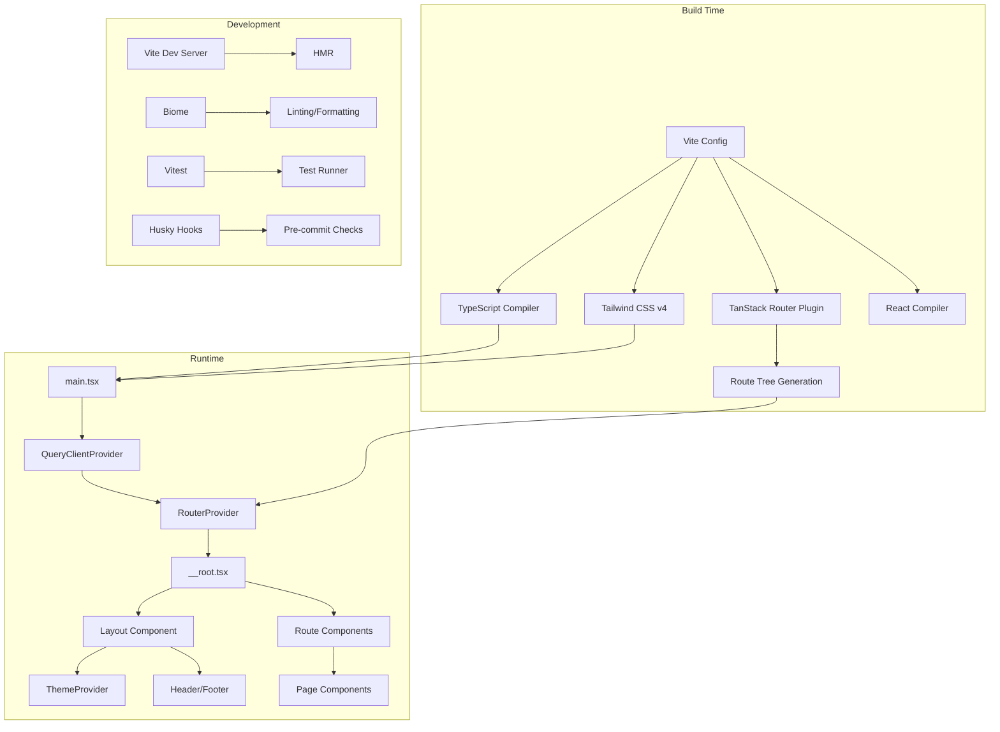

# Vite React Tailwind Starter


A production-ready starter template for React applications built with Vite, TypeScript, and Tailwind CSS v4. This template provides a modern development experience with file-based routing, type-safe environment variables, and comprehensive tooling for code quality and testing.

[**Live Demo**](https://vite-react-tailwind-starter.sznm.dev/)

[](https://vercel.com/import/git?s=https://github.com/agustinusnathaniel/vite-react-tailwind-starter) [](https://app.netlify.com/start/deploy?repository=https://github.com/agustinusnathaniel/vite-react-tailwind-starter)

[](https://stackblitz.com/github/agustinusnathaniel/vite-react-tailwind-starter)

[](https://sonarcloud.io/summary/new_code?id=sozonome_vite-react-tailwind-starter) [](https://sonarcloud.io/summary/new_code?id=sozonome_vite-react-tailwind-starter) [](https://sonarcloud.io/summary/new_code?id=sozonome_vite-react-tailwind-starter) [](https://sonarcloud.io/summary/new_code?id=sozonome_vite-react-tailwind-starter) [](https://sonarcloud.io/summary/new_code?id=sozonome_vite-react-tailwind-starter) [](https://sonarcloud.io/summary/new_code?id=sozonome_vite-react-tailwind-starter) [](https://sonarcloud.io/summary/new_code?id=sozonome_vite-react-tailwind-starter) [](https://sonarcloud.io/summary/new_code?id=sozonome_vite-react-tailwind-starter) [](https://sonarcloud.io/summary/new_code?id=sozonome_vite-react-tailwind-starter)

## Overview

This template solves the problem of bootstrapping a modern React application with:
- **Fast development**: Vite-based HMR and build pipeline
- **Type safety**: Full TypeScript coverage with strict mode
- **Routing**: File-based routing via TanStack Router
- **Styling**: Tailwind CSS v4 with dark mode support
- **State management**: TanStack Query for server state
- **Code quality**: Biome for linting/formatting, TypeScript checking, and testing
- **Developer experience**: DevTools integration, environment validation, and PWA support

### What This Template Provides

- Production-ready build configuration
- Type-safe environment variable validation
- File-based routing with code splitting
- Theme system with dark/light/system modes
- Testing setup with Vitest
- Git hooks for code quality enforcement
- Deployment configurations for Vercel, Netlify, and Cloudflare Workers

### What This Template Does Not Provide

- Backend API implementation
- Authentication/authorization logic
- Database integration
- State management library (beyond TanStack Query)
- UI component library (beyond basic layout components)

## Architecture



### Core Modules

| Module | Location | Responsibility |
|--------|----------|----------------|
| **Routing** | `src/routes/` | File-based route definitions, auto-generated route tree |
| **Pages** | `src/lib/pages/` | Page-level components organized by route |
| **Layout** | `src/lib/layout/` | Application shell (Header, Footer, Layout wrapper) |
| **Components** | `src/lib/components/` | Reusable UI components (ThemeProvider, ThemeToggle) |
| **Services** | `src/lib/services/` | Shared services and constants (QueryClient) |
| **Utils** | `src/lib/utils/` | Pure utility functions |
| **Styles** | `src/lib/styles/` | Global CSS and Tailwind configuration |

## Tech Stack

### Core Dependencies

- **React 19.2.0**: UI library
- **Vite 7.1.20** (rolldown-vite): Build tool and dev server
- **TypeScript 5.9.3**: Type system
- **Tailwind CSS 4.1.17**: Utility-first CSS framework
- **TanStack Router 1.135.2**: Type-safe file-based routing
- **TanStack Query 5.90.7**: Server state management
- **Zod 4.1.12**: Runtime type validation

### Development Tools

- **Biome 2.3.4**: Linter and formatter (replaces ESLint/Prettier)
- **Vitest 4.0.8**: Test runner
- **Husky 9.1.7**: Git hooks
- **Commitlint**: Conventional commit validation
- **Turbo**: Task runner for parallel execution

### Build Plugins

- `@vitejs/plugin-react`: React support with Fast Refresh
- `@tanstack/router-plugin`: File-based route generation
- `@tailwindcss/vite`: Tailwind CSS v4 integration
- `vite-plugin-pwa`: PWA manifest and service worker
- `@julr/vite-plugin-validate-env`: Environment variable validation
- `vite-plugin-checker`: TypeScript checking in dev mode

## Repository Structure

```
vite-react-tailwind-starter/
├── src/
│   ├── lib/
│   │   ├── components/          # Reusable UI components
│   │   │   ├── theme-provider.tsx
│   │   │   └── theme-toggle.tsx
│   │   ├── layout/              # Layout components
│   │   │   ├── components/
│   │   │   │   ├── header.tsx
│   │   │   │   └── footer.tsx
│   │   │   └── index.tsx
│   │   ├── pages/               # Page components
│   │   │   ├── 404/
│   │   │   └── home/
│   │   ├── services/             # Shared services
│   │   │   └── constants.ts
│   │   ├── styles/               # Global styles
│   │   │   └── globals.css
│   │   └── utils/                # Utility functions
│   │       ├── sample.ts
│   │       └── sample.test.ts
│   ├── routes/                   # TanStack Router routes
│   │   ├── __root.tsx           # Root route with layout
│   │   └── index.tsx            # Home route
│   ├── main.tsx                  # Application entry point
│   ├── routeTree.gen.ts         # Auto-generated route tree
│   └── env.d.ts                  # Environment type definitions
├── public/                       # Static assets
├── dist/                         # Build output
├── vite.config.ts                # Vite configuration
├── tsconfig.json                 # TypeScript configuration
├── biome.json                    # Biome linter/formatter config
├── vitest.config.ts              # Vitest test configuration
├── env.ts                        # Environment variable schema
└── package.json
```

## Getting Started

### Prerequisites

- **Node.js**: ^24.11.x (specified in `engines`)
- **pnpm**: 10.24.0 (specified in `packageManager`)

### Installation

You can either click [`Use this template`](https://github.com/agustinusnathaniel/vite-react-tailwind-starter/generate) button on this repository and clone the repo or use npx degit:

```bash
npx degit agustinusnathaniel/vite-react-tailwind-starter <app_name>
cd <app_name>
pnpm install
```

### Development

Start the development server:

```bash
pnpm dev
```

The application will be available at `http://localhost:3000` with HMR enabled.

### Building

Build for production:

```bash
pnpm build
```

Output will be in the `dist/` directory.

### Testing

Run tests:

```bash
pnpm test              # Run tests once
pnpm test:ui           # Run tests with UI and coverage
pnpm test:coverage     # Run tests with coverage report
```

### Code Quality

```bash
pnpm biome:check       # Check code style and linting
pnpm biome:fix         # Auto-fix code style issues
pnpm type:check        # TypeScript type checking
pnpm check:turbo       # Run all checks in parallel (biome, type, test)
```

## Configuration

### Environment Variables

Environment variables are validated at build time using Zod. Define your schema in `env.ts`:

```typescript
// env.ts
export default defineConfig({
  schema: {
    VITE_API_BASE_URL: z.string().optional(),
  },
});
```

Access variables in code with type safety:

```typescript
import.meta.env.VITE_API_BASE_URL
```

### TypeScript Paths

Path aliases are configured in `tsconfig.json`:

```json
{
  "paths": {
    "@/*": ["./src/*"]
  }
}
```

Use in imports:

```typescript
import { Layout } from '@/lib/layout';
```

### Tailwind CSS

Tailwind CSS v4 is configured via the `@tailwindcss/vite` plugin. Global styles and customizations are in `src/lib/styles/globals.css`.

### Routing

Routes are defined as files in `src/routes/`. TanStack Router automatically generates the route tree. See [TanStack Router documentation](https://tanstack.com/router) for advanced patterns.

## Deployment

### Build Configuration

- **Build command**: `pnpm build`
- **Output directory**: `dist/`
- **Node version**: ^24.11.x

### Platform-Specific Guides

- **Vercel**: https://vercel.com/docs/frameworks/vite
- **Netlify**: https://docs.netlify.com/frameworks/vite/
- **Cloudflare Workers**: Configuration in `wrangler.toml`

## Development Workflows

### Adding a New Route

1. Create a file in `src/routes/` (e.g., `src/routes/about.tsx`)
2. Export a `Route` using `createFileRoute`
3. The route tree will auto-regenerate

### Adding a New Page Component

1. Create directory in `src/lib/pages/` (e.g., `src/lib/pages/about/`)
2. Create `index.tsx` with your page component
3. Import and use in the corresponding route file

### Adding Environment Variables

1. Add schema definition in `env.ts`
2. Create `.env` file with your variables (prefixed with `VITE_`)
3. Access via `import.meta.env.VITE_*` with full type safety

### Git Workflow

- **Pre-commit**: Runs Biome formatting/linting on staged files
- **Commit-msg**: Validates commit message format (Conventional Commits)
- **Pre-push**: Runs full check suite (biome, type-check, tests)

## References

- [Vite](https://vitejs.dev)
  - [Avoid manual import](https://vitejs.dev/guide/features.html#jsx)
- [TailwindCSS](https://tailwindcss.com/)
- [TypeScript](https://www.typescriptlang.org)
- [TanStack Router](https://tanstack.com/router)
- [TanStack Query](https://tanstack.com/query)

## License

See [LICENSE](./LICENSE) file.
