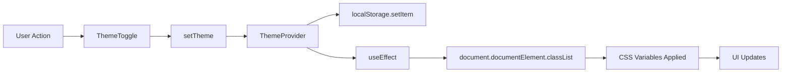
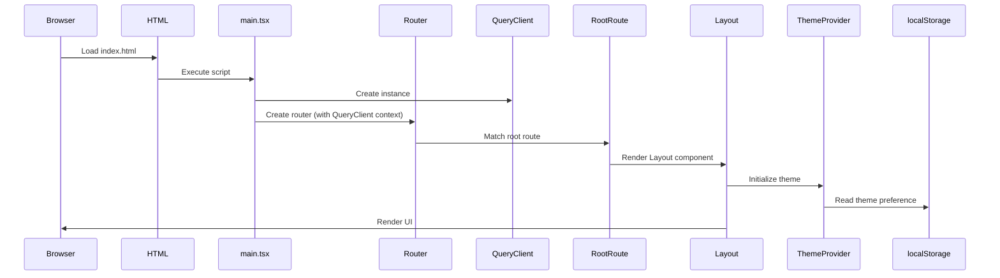
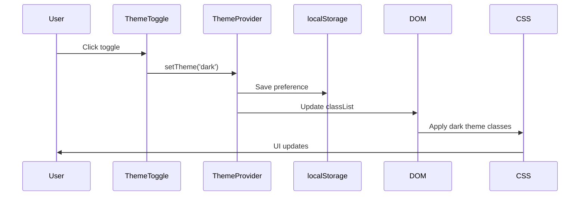

# System Specification

This document defines the system-level specification, core concepts, invariants, and expected behaviors of the Vite React Tailwind Starter template.

## System Purpose

This template provides a production-ready foundation for React applications with:
- Fast development experience via Vite
- Type-safe routing and environment configuration
- Modern styling with Tailwind CSS v4
- Server state management via TanStack Query
- Comprehensive developer tooling

## Core Concepts

### File-Based Routing

Routes are defined as files in `src/routes/`. TanStack Router generates a type-safe route tree at build time.

**Invariants:**
- Route files must export a `Route` constant created with `createFileRoute` or `createRootRoute`
- The root route must be `__root.tsx`
- Route file names determine URL paths (e.g., `about.tsx` → `/about`)
- Route tree is auto-generated in `src/routeTree.gen.ts` (do not edit manually)

**Example:**
```typescript
// src/routes/about.tsx
import { createFileRoute } from '@tanstack/react-router';
import AboutPage from '@/lib/pages/about';

export const Route = createFileRoute('/about')({
  component: AboutPage,
});
```

### Environment Variables

Environment variables are validated at build time using Zod schemas defined in `env.ts`.

**Invariants:**
- All environment variables must be prefixed with `VITE_` to be exposed to client code
- Schema is defined in `env.ts` using `@julr/vite-plugin-validate-env`
- Type definitions are auto-generated in `src/env.d.ts`
- Missing required variables cause build failures
- Optional variables are typed as `string | undefined`

**Example:**
```typescript
// env.ts
export default defineConfig({
  schema: {
    VITE_API_BASE_URL: z.string().url(),
  },
});

// Usage
const apiUrl = import.meta.env.VITE_API_BASE_URL; // Fully typed
```

### Theme System

The application supports three theme modes: `light`, `dark`, and `system`.

**Invariants:**
- Theme state is stored in `localStorage` with key `vite-ui-theme`
- Theme is applied via CSS class on `document.documentElement` (`light` or `dark`)
- System theme follows `prefers-color-scheme` media query
- Theme provider must wrap the application (done in `Layout`)
- Theme toggle component uses `@theme-toggles/react` library

**Theme Flow:**



### Component Architecture

**Page Components** (`src/lib/pages/`):
- Represent full page views
- Organized by route (e.g., `home/`, `404/`)
- Default export from `index.tsx`
- Composed of smaller components

**Layout Components** (`src/lib/layout/`):
- Provide application shell structure
- Include Header, Footer, and main wrapper
- Wrap all routes via `__root.tsx`

**Reusable Components** (`src/lib/components/`):
- Shared UI components
- Named exports (not default)
- Self-contained with own styles/logic

**Invariants:**
- Page components use default exports
- Reusable components use named exports
- Components are functional (no class components)
- Props are typed with TypeScript interfaces/types

### Query Client

TanStack Query client is instantiated once and provided at the root level.

**Invariants:**
- Single `QueryClient` instance created in `src/lib/services/constants.ts`
- Provided via `QueryClientProvider` in `main.tsx`
- Available in router context for route loaders
- Default configuration can be extended per project needs

## Expected Behaviors

### Development Server

1. **Startup**: Vite dev server starts on port 3000
2. **HMR**: Hot Module Replacement updates components without full page reload
3. **Route Generation**: Route tree regenerates when route files change
4. **Type Checking**: TypeScript errors shown in browser overlay (dev mode only)
5. **DevTools**: TanStack DevTools panel available in development

### Build Process

1. **Type Checking**: TypeScript compilation with strict mode
2. **Route Tree**: Generated from route files
3. **Code Splitting**: Automatic per route via TanStack Router
4. **Asset Optimization**: Vite handles minification and optimization
5. **PWA Assets**: Generated if PWA plugin enabled (currently disabled)

### Runtime Behavior

1. **Initial Load**:
   - HTML shell loads from `index.html`
   - `main.tsx` executes, creates router and React root
   - Router matches current URL to route
   - Route component renders inside Layout

2. **Navigation**:
   - TanStack Router handles client-side navigation
   - Preloads routes on intent (hover/focus)
   - Scroll restoration enabled by default
   - Structural sharing prevents unnecessary re-renders

3. **Theme**:
   - Reads from `localStorage` on mount
   - Falls back to `system` if not set
   - Applies CSS class immediately
   - Persists changes to `localStorage`

## Constraints

### TypeScript Constraints

- **Strict Mode**: All strict checks enabled
- **No `any`**: Implicit any is disallowed
- **Unused Variables**: Compile error for unused locals/parameters
- **Module Resolution**: `bundler` mode (ESM-focused)
- **JSX**: `react-jsx` transform (no need to import React)

### Build Constraints

- **Node Version**: ^24.11.x (enforced in `engines`)
- **Package Manager**: pnpm 10.24.0 (enforced in `packageManager`)
- **Output**: ESM modules only (no CommonJS)
- **Target**: ES2022

### Code Style Constraints

- **Quotes**: Single quotes for strings
- **Semicolons**: Required (Biome default)
- **Indentation**: 2 spaces
- **Line Length**: No hard limit (Biome default)
- **Exports**: Named exports preferred (default only for routes/pages)

## Non-Goals

This template intentionally does not provide:

1. **Backend Integration**: No API client setup or authentication
2. **State Management**: No global state library (beyond TanStack Query)
3. **UI Component Library**: No comprehensive component set (only basic layout)
4. **Form Handling**: No form library or validation setup
5. **Internationalization**: No i18n configuration
6. **E2E Testing**: No Playwright/Cypress setup
7. **Storybook**: No component documentation tooling

## Known Limitations

### Route Tree Generation

- Route tree must regenerate on dev server start
- Manual edits to `routeTree.gen.ts` are overwritten
- Complex route patterns may require explicit route definitions

### Environment Variables

- Variables must be known at build time
- Runtime environment switching not supported
- All client-accessible variables must be prefixed with `VITE_`

### PWA Support

- PWA plugin is currently disabled (`disable: true` in `vite.config.ts`)
- Service worker not registered
- Manifest generation works but service worker must be enabled manually

### Testing

- Test coverage only enforced for `src/lib/utils/` directory
- Component testing setup is minimal
- E2E testing not included

### Browser Support

- Modern browsers only (ES2022 target)
- No polyfills included
- Assumes native support for:
  - ES Modules
  - CSS Custom Properties
  - `localStorage`
  - `matchMedia` (for theme detection)

## Edge Cases

### Theme Persistence

- If `localStorage` is unavailable, theme falls back to `system`
- Theme changes persist across sessions
- System theme changes are detected automatically (when theme is `system`)

### Route Not Found

- 404 page component defined in `src/lib/pages/404/`
- Used as `defaultNotFoundComponent` in router config
- Renders when no route matches

### Route Preloading

- Routes preload on intent (hover/focus) by default
- Can be disabled per route or globally
- Preload stale time is 0 (always fetch fresh)

### Query Client Context

- Query client available in router context
- Can be accessed in route loaders via `context.queryClient`
- Not automatically available in components (use `useQueryClient` hook)

## Data Flow

### Application Initialization



### Route Navigation

```mermaid
sequenceDiagram
    participant User
    participant Link
    participant Router
    participant RouteLoader
    participant QueryClient
    participant Component
    
    User->>Link: Click navigation link
    Link->>Router: Navigate to route
    Router->>RouteLoader: Execute loader (if defined)
    RouteLoader->>QueryClient: Fetch data
    QueryClient->>RouteLoader: Return data
    Router->>Component: Render route component
    Component->>User: Display updated UI
```

### Theme Change



## Trade-offs

### Type Safety vs. Flexibility

- **Choice**: Strict TypeScript with runtime validation
- **Trade-off**: More boilerplate, but catches errors early
- **Rationale**: Template should enforce best practices

### File-Based Routing vs. Code-Based

- **Choice**: File-based routing (TanStack Router)
- **Trade-off**: Less flexible than code-based, but more intuitive
- **Rationale**: Simpler mental model for most developers

### Biome vs. ESLint/Prettier

- **Choice**: Single tool (Biome) for linting and formatting
- **Trade-off**: Less ecosystem support, but faster and simpler
- **Rationale**: Reduces tooling complexity

### pnpm vs. npm/yarn

- **Choice**: pnpm as package manager
- **Trade-off**: Less universal, but better performance and disk usage
- **Rationale**: Modern best practice for monorepos and efficiency

## Assumptions

1. **Modern Development Environment**: Developers use Node 24+, modern editors, and Git
2. **ESM-First**: All code uses ES modules (no CommonJS)
3. **Client-Side Rendering**: No SSR/SSG (pure SPA)
4. **TypeScript Adoption**: All code is TypeScript (no JavaScript files)
5. **Component Patterns**: Functional components with hooks (no class components)
6. **Styling Approach**: Utility-first CSS (Tailwind) with minimal custom CSS

## Future Considerations

Potential enhancements (not currently implemented):
- SSR/SSG support via TanStack Start
- More comprehensive component library
- Form handling integration
- Internationalization setup
- E2E testing framework
- Storybook integration
- Advanced PWA features (offline support, push notifications)

